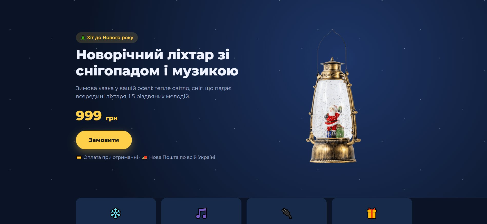

# Лендинг товара с приёмом заказов в Telegram

**Живой сайт:** https://fonar-landing.onrender.com — работает в **демо-режиме**: форму можно заполнить, но заказ никуда не отправляется.

Одностраничный магазин под один товар — новогодний LED-фонарь со снегопадом и музыкой (дропшиппинг, поставщик Dropt).
Покупатель оставляет заявку на сайте — через секунду она приходит продавцу в Telegram с товаром, артикулом поставщика, суммой и контактами.
Сделано под запуск рекламы в Facebook / Instagram.



---

## Коротко о проекте

| | |
|---|---|
| **Задача** | Быстро проверить спрос на товар без маркетплейса и CRM: страница под рекламу + удобный приём заказов |
| **Результат** | Сайт в продакшене на Render, заявки приходят в Telegram, проверено реальными заказами от внешних пользователей |
| **Стек** | Python, Flask, Gunicorn, Jinja2, HTML/CSS/JS, Telegram Bot API, Meta Pixel, Git/GitHub, Render |
| **Срок** | от идеи до работающего сайта — 2 дня |

## Что умеет

- **Продающая страница**: первый экран с ценой и кнопкой, преимущества, галерея, характеристики, «как заказать», FAQ. Адаптирована под телефон.
- **Форма заказа без перезагрузки** (fetch + JSON), проверка имени и украинского номера телефона на сервере.
- **Заявка в Telegram**: бот присылает товар, модель, артикул Dropt, количество, сумму, имя, телефон, комментарий и время по Киеву.
- **Надёжная доставка заявки**: до 10 повторных попыток при плохой связи с Telegram; отправка идёт в фоновом потоке — покупатель не ждёт.
- **Резервная копия** каждой заявки в `orders.csv` — записывается до отправки в Telegram.
- **Защита от спам-ботов**: скрытое поле-ловушка (honeypot).
- **Аналитика для рекламы**: Meta Pixel — события `PageView` и `Lead` (после успешной заявки). Подключается одной переменной.
- **Безопасность**: токен бота только в переменных окружения, в репозиторий не попадает и не пишется в логи.
- **Демо-режим** (включён по умолчанию): форма и проверка данных работают, но заявки не сохраняются и не отправляются, посетитель видит пометку «демо». Боевой режим — `DEMO_MODE=0`.
- **Легко переделать под другой товар**: название, цена и артикул — в одном словаре `PRODUCT` в `app.py`.

## Как это работает

```
Покупатель ──► Лендинг (Flask + Jinja2) ──► POST /order
                                              │
                                              ├─ проверка данных
                                              ├─ запись в orders.csv
                                              ├─ ответ «ok» покупателю (сразу)
                                              └─ фоновый поток ──► Telegram Bot API ──► продавец
                                                                     (до 10 попыток)
```

## Как я это делал — по шагам

1. **Выбор товара.** Взял сезонный товар у дропшиппинг-поставщика Dropt, собрал характеристики и фото.
2. **Лендинг.** Свёрстал одну страницу на Flask + Jinja2: все данные товара подставляются из одного места.
3. **Приём заказов.** Создал Telegram-бота через @BotFather, написал скрипт `nastroyka.bat`, который сам находит chat_id и создаёт `.env`.
4. **Резервная копия.** Добавил запись заявок в CSV, чтобы ни один заказ не потерялся.
5. **Проблема: нестабильный интернет до Telegram.** В логах — `ConnectTimeoutError`, заявки терялись. Решение: повторные попытки с паузой, отправка в фоновом потоке, в лог пишется только тип ошибки — без URL с токеном.
6. **Подготовка к выкладке.** `.gitignore` для секретов и данных покупателей, Gunicorn для продакшена, проверка, что токен не попал в git.
7. **Деплой.** Код на GitHub, сайт на Render, токен — в переменных окружения Render.
8. **Проблема: неправильное время в заявках.** Сервер работает по UTC, заказы приходили на 3 часа «раньше». Решение: время по `Europe/Kyiv` через `zoneinfo`.
9. **Тест на реальных людях.** Отправил ссылку знакомым: заявки пришли в Telegram со всеми данными.
10. **Перевод в демо-режим для портфолио.** Тестовый бот отключён, сайт остаётся витриной: форма работает, но никому ничего не приходит.

## Для резюме

> **Лендинг с приёмом заказов в Telegram** — [fonar-landing.onrender.com](https://fonar-landing.onrender.com) · [GitHub](https://github.com/maksiart444/fonar-landing)
>
> Самостоятельно запустил одностраничный интернет-магазин под дропшиппинг-товар: от выбора товара до работающего сайта в интернете.
> - Бэкенд на Python/Flask: приём и проверка заказов, отправка в Telegram через Bot API, резервное сохранение в CSV.
> - Сделал доставку заявок устойчивой к обрывам связи: повторные попытки и фоновая отправка — покупатель получает ответ мгновенно.
> - Позаботился о безопасности: секреты в переменных окружения, токен не попадает ни в репозиторий, ни в логи; защита формы от ботов.
> - Подготовил к рекламе: адаптивная вёрстка, Meta Pixel с событиями `PageView` и `Lead`.
> - Выложил в продакшен (GitHub → Render, Gunicorn), проверил на реальных заказах.
> - Разрабатывал вместе с ИИ-ассистентом Claude Code: ставил задачи, проверял результат, тестировал на живом сайте.

---

## Запуск у себя (Windows)

```powershell
git clone https://github.com/maksiart444/fonar-landing.git
cd fonar-landing
python -m venv venv
.\venv\Scripts\Activate.ps1
pip install -r requirements.txt
copy .env.example .env   # впиши токен бота и chat_id
python app.py            # http://127.0.0.1:5000
```

Без командной строки: `nastroyka.bat` — подключить бота (один раз), `zapusk.bat` — запустить сайт, `foto.bat` — скачать фото товара.

### Как получить токен и chat_id

1. В Telegram найди **@BotFather** → `/newbot` → получишь **токен**.
2. Напиши своему боту любое сообщение.
3. Открой `https://api.telegram.org/bot<ТОКЕН>/getUpdates` и найди `"chat":{"id":...}` — это **chat_id**.
   (Или просто запусти `nastroyka.bat` — он сделает это сам.)

## Выкладка на Render

1. **New → Web Service** → выбрать этот репозиторий.
2. Build Command: `pip install -r requirements.txt`
3. Start Command: `gunicorn app:app`
4. **Environment**: `TELEGRAM_BOT_TOKEN`, `TELEGRAM_CHAT_ID`, `META_PIXEL_ID` (можно пустой), `DEMO_MODE=0` — чтобы принимать настоящие заказы.

На бесплатном тарифе сайт «засыпает» после 15 минут без посетителей (первое открытие — 30–60 сек), а `orders.csv` стирается при перезапуске. Для рекламы — платный тариф или пинг через UptimeRobot.

## Структура

```
fonar-landing/
├── app.py               ← сервер Flask: страница, приём заказов, отправка в Telegram
├── templates/index.html ← лендинг
├── static/style.css     ← оформление
├── static/img/          ← фото товара
├── docs/screenshot.jpg  ← скриншот для README
├── requirements.txt
├── .env.example         ← пример настроек (настоящий .env в git не попадает)
├── nastroyka.bat        ← мастер подключения Telegram-бота
├── zapusk.bat           ← запуск сайта на компьютере
└── foto.bat             ← скачивание фото товара
```

## Другой товар

Скопируй репозиторий, поменяй `PRODUCT` в `app.py`, тексты в `templates/index.html` и фото в `static/img/` — готов следующий лендинг.
